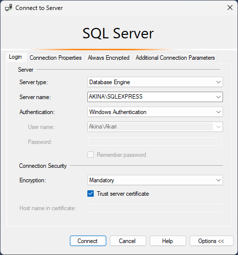

# Подключение к серверу
1. Ищем в пуске "**SQL Server Management Studio**"
2. Пишем необходимый сервер, по умолчанию "<имя пк>\SQLEXPRESS"

### Подробнее
Нас всегда интересует вкладка «login», остальным мы никогда не пользуемся. В ней у нас есть Server и Security, мы будем работать с первым.

- **Server type** – Тип сервера, он всегда один и тот же
- **Server name** – Это ссылка до сервера, по умолчанию стоит ядро что мы установили ранее, на работе у вас будет отдельный сервер со своей ссылкой
- **Authentication** – Авторизация, кто именно входит на сервер, т.к. обычным аналитикам не дают много прав, чтобы ничего не сломать на серваках, мы работать будем с Windows Auth, он берет логин и пароль от винды, и для него факт что ты зашел в винду, есть факт что ты можешь зайти
- **Username\Password** – Логично, логин и пароль, если выбрать другую авторизацию

После заполенения всех полей, нажимаете "Connect"

При успешном запуске слева в меню будет новое подключение к вашему серверу